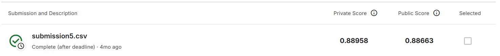

# Binary Classification with a Bank Churn Dataset  

Проект направлен на решение задачи бинарной классификации для прогнозирования клиентского оттока. 
Основная цель — предсказать, уйдет ли клиент из банка, основываясь на предоставленных данных.  

### 🛠️ Основные детали проекта  

- **Датасет**: Содержит данные о клиентах банка, такие как возраст, баланс, количество продуктов, активность и другие показатели.  
- **Задача**: Бинарная классификация, где целевая переменная (target) указывает, останется ли клиент (0) или уйдет (1).  
- **Метрика**: Submissions оцениваются с использованием метрики **ROC-AUC**.  

### 💡 Используемые библиотеки  
- **Pandas**: для обработки данных.  
- **NumPy**: для вычислений.  
- **Optuna**: для подбора гиперпараметров. 
- **Scikit-learn**: для предобработки данных, обучения моделей, стекинга и оценки метрик.  
- **XGBoost, LightGBM, CatBoost**: для обучения бустинговых моделей.  
- **Matplotlib, Seaborn**: для визуализации данных.   

- [Kaggle Competition Page](https://www.kaggle.com/competitions/playground-series-s4e1/overview)  